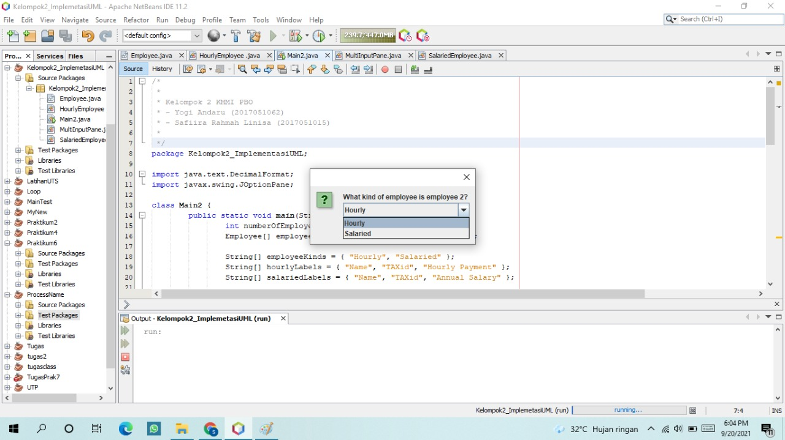
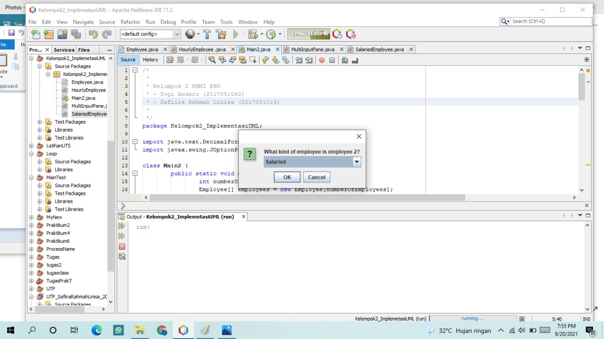
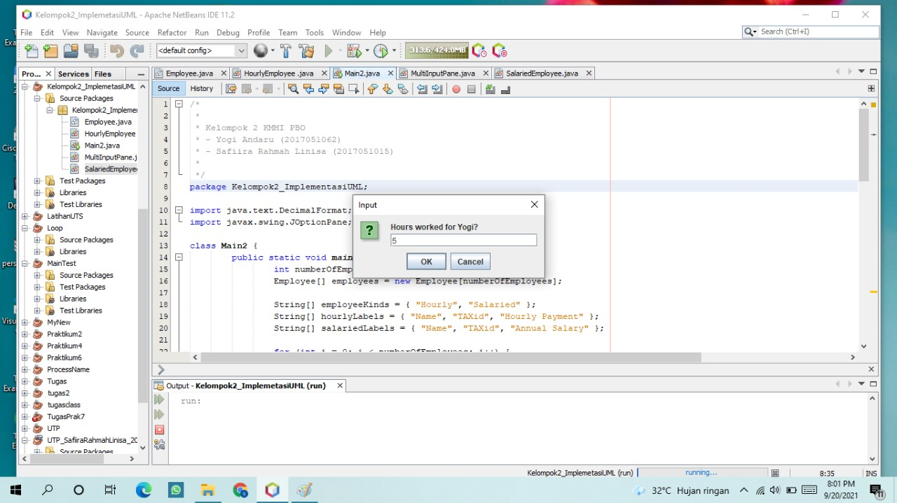
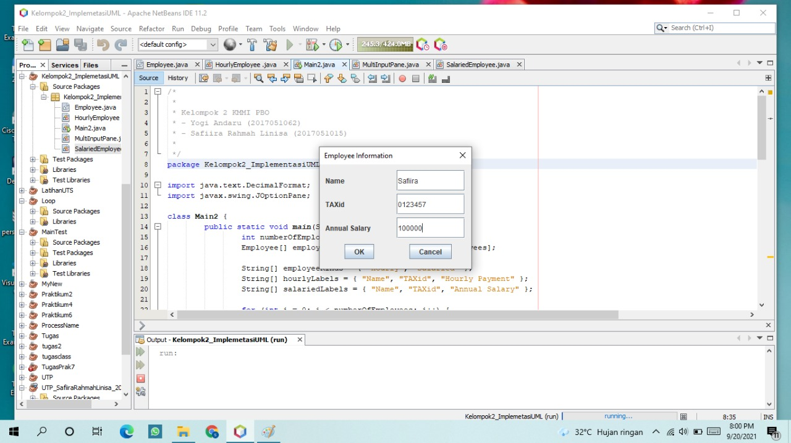
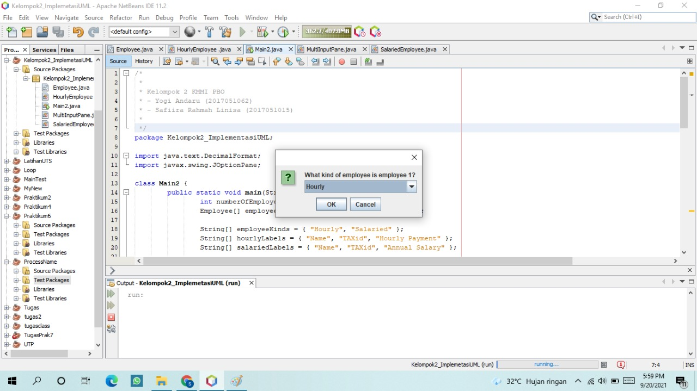
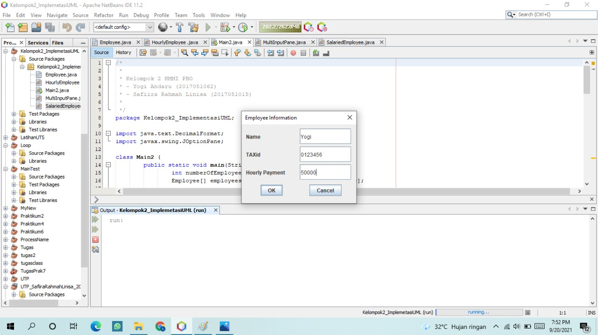
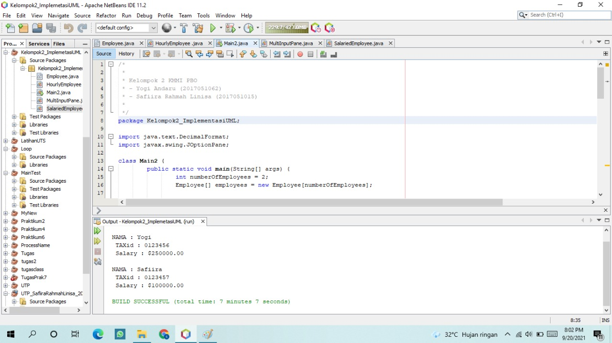
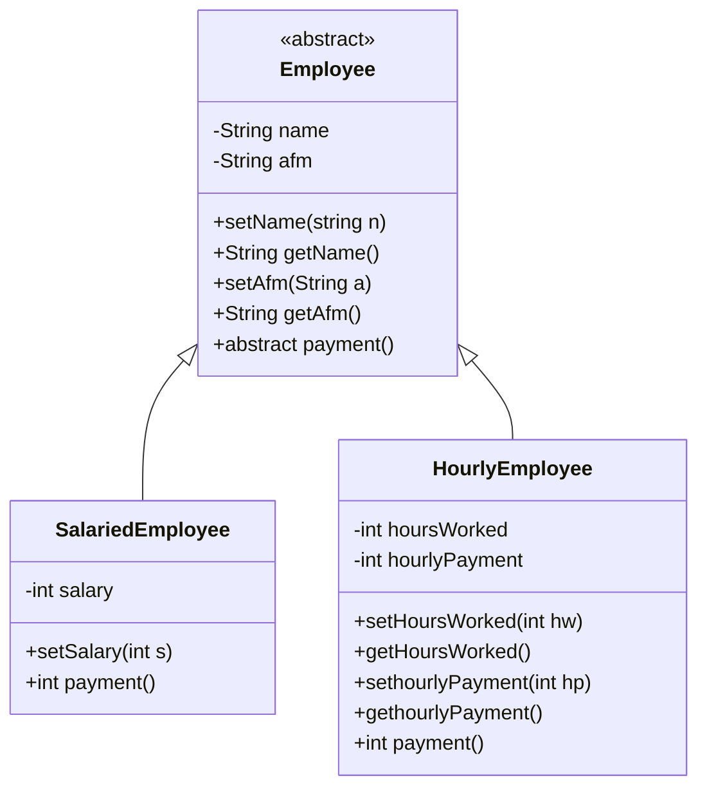

# IMPLEMENTASI UML CLASS DIAGRAM
## KELOMPOK 2 TUGAS PBO
## link [`github`](https://github.com/yogiandaru98/kelompok2_implemantasiuml)

* YOGI ANDARU
* 2017051062
* SAFIIRA RAHMAH LINISA
* 2017051015
#
## LAMPIRAN

## CLASS STRUCTURE
> Agar dapat melihat class diagram di bawah terlebih dahulu download [`MERMAID`](https://www.google.com/url?sa=t&rct=j&q=&esrc=s&source=web&cd=&cad=rja&uact=8&ved=2ahUKEwiI0pbxo__yAhUDSX0KHRo9CSgQFnoECAMQAQ&url=https%3A%2F%2Fchrome.google.com%2Fwebstore%2Fdetail%2Fmermaid-diagrams%2Fphfcghedmopjadpojhmmaffjmfiakfil&usg=AOvVaw3XUo81gMc0iadYNU_ZxFRU) extension pada browser.

#
## REFRENCE
#### Dalam pembuatan program ini kami menambahkan class MultiInputPanel yang mana class tersebut child class tambahan dari library JOptionPane.
###
#### Class MultiInputPanel memiliki fungsi yaitu dapat memunculkan panel program seperti JOptionPane akan tetapi perbedaannya yaitu class ini dapat memiliki beberapa input dalam satu panel.
###
###  SOURCE MultiInputPanel

>- `Sumber library` : [KLIK DISINI](http://www.cs.gordon.edu/courses/cs211/AddressBookExample/Code.html)
>- `Dokumentasi` : [KLIK DISINI](http://www.cs.gordon.edu/courses/cs211/AddressBookExample/Javadoc/MultiInputPane.html#method_summary)

